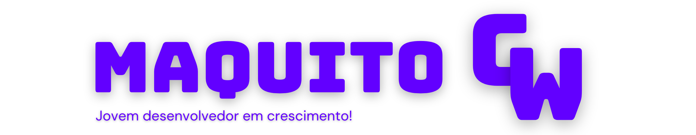

  

###

  
  
  
  

###

<h1 align="center">Hello World👋</h1>

###

<h3 align="left">👩‍💻 Sobre Mim</h3>

###

Desenvolvedor Full Stack com foco em aprendizado contínuo e resolução de problemas de forma eficiente e inovadora. Atualmente, estou aprimorando minhas habilidades em Node.js e React.js, enquanto aprofundo meu conhecimento em PHP e no framework Laravel. Tenho uma sólida base em desenvolvimento web, desde a criação de APIs até a implementação de interfaces responsivas, com atenção aos detalhes e uma visão crítica que me permite oferecer soluções funcionais e bem projetadas.  Sou proativo, comunicativo e aprendo com facilidade, o que me torna adaptável a novas tecnologias e desafios. Minha paixão por tecnologia e desenvolvimento de software impulsiona meu interesse futuro em explorar o campo de Inteligência Artificial e criar soluções inovadoras que impactem positivamente o mercado.  Minha jornada na área de TI ainda está no início, mas estou determinado a transformar cada experiência em um aprendizado valioso que contribuirá para o meu crescimento como profissional e para o sucesso dos projetos em que atuo.

###

⪼ O código do meu portfólio está disponível em: [MaquitoGW](https://github.com/MaquitoGW/MaquitoGW). Todo o portfólio foi desenvolvido utilizando Laravel e é totalmente customizável para seu uso.

📌 [Acesse meu portfólio](https://maquitogw.awefortec.com)

###

<h3 align="left">🛠 Linguagens, Ferramentas & Frameworks</h3>

###

  
  
  
  
  
  
  
  
  
  
  
  
  
  
  
  
  

###

<h3 align="left">💪 Estou aprendendo/planejando aprender</h3>

###

  
  
  
  
  
  
  

###

<h3 align="left">🔥 Minhas estatísticas</h3>

###

  
  

###

@ 2024 Maicon Gonçalves Wandermazz

###
